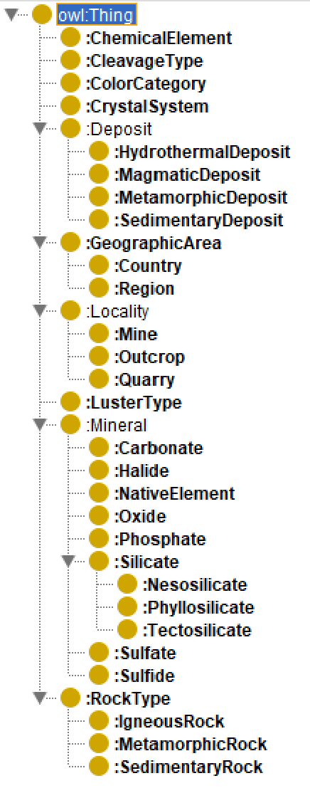
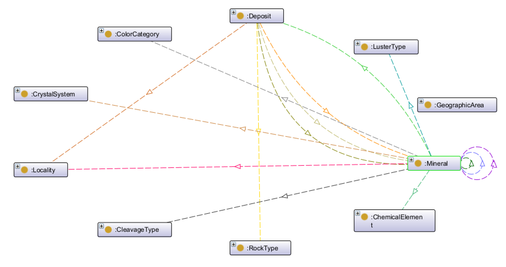
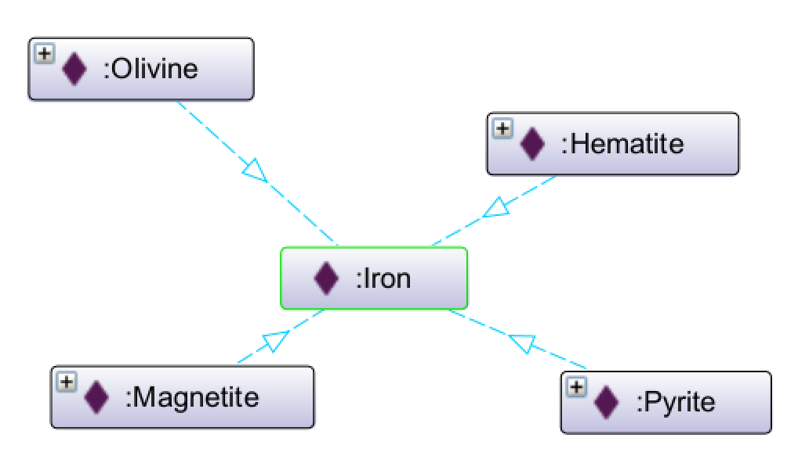
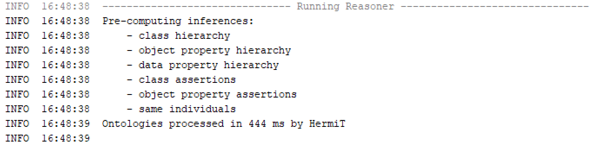
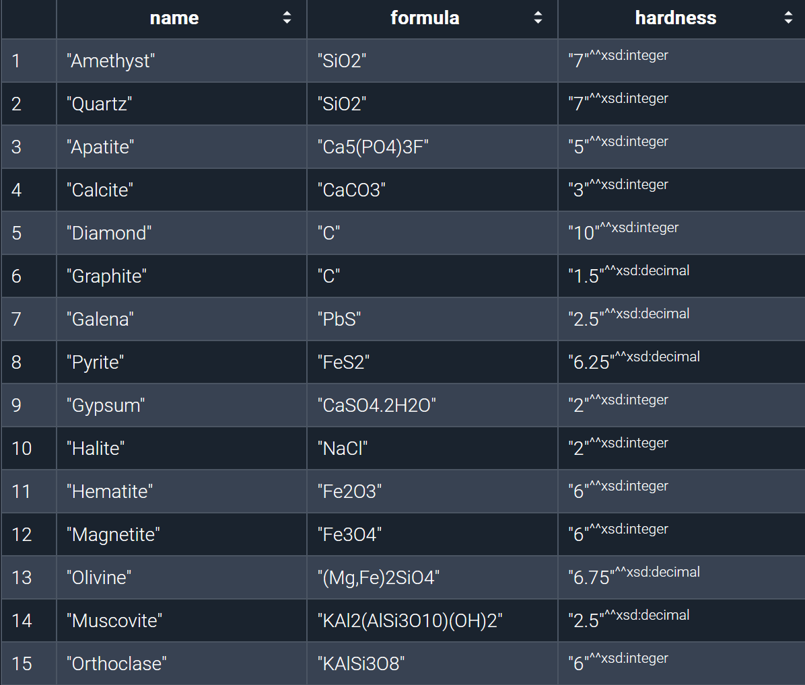
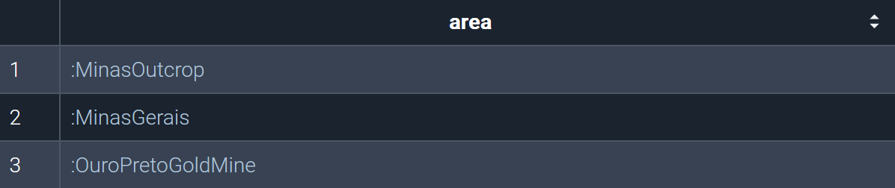

# Mineralogy Knowledge Graph

An OWL ontology modeling minerals, their physical/chemical properties, and the deposits and localities where they occur. Built in [Protégé](https://protege.stanford.edu/), validated with the HermiT reasoner, and queried with SPARQL in GraphDB.

## Class hierarchy

Minerals are classified first by chemical composition. Silicates form the largest branch and split further into tectosilicates, nesosilicates, and phyllosilicates; oxides, sulfides, sulfates, carbonates, halides, phosphates, and native elements make up the rest of the top level. Alongside `Mineral` sit the controlled-vocabulary classes (`CrystalSystem`, `ColorCategory`, `LusterType`, `CleavageType`) and the geography/geology branch (`Deposit`, `Locality`, `GeographicArea`, `RockType`).


The same structure, viewed as a graph of the top-level classes and how they connect to `Mineral`:



<details>
<summary>Full class table (33 classes)</summary>

| Class | Superclass | Description |
|---|---|---|
| Mineral | owl:Thing | Natural inorganic substance of definite chemical composition and ordered internal structure; central class of the model. |
| Silicate | Mineral | Mineral built on silicon-oxygen compounds; the most numerous mineral group. |
| Tectosilicate | Silicate | Silicate whose building units form a 3D network, as in quartz and feldspar. |
| Nesosilicate | Silicate | Silicate whose building units are isolated and share no oxygen atoms, as in olivine. |
| Phyllosilicate | Silicate | Silicate whose building units are arranged in sheets, as in micas. |
| Oxide | Mineral | Mineral formed by a metal bonding with oxygen, e.g. hematite. |
| Sulfide | Mineral | Mineral in which a metal is bonded with sulfur, e.g. pyrite or galena. |
| Sulfate | Mineral | Mineral built on the sulfate group (SO4), e.g. gypsum. |
| Carbonate | Mineral | Mineral built on the carbonate group (CO3), e.g. calcite. |
| Halide | Mineral | Mineral in which a metal is bonded with a halogen element, e.g. halite. |
| Phosphate | Mineral | Mineral built on the phosphate group (PO4), e.g. apatite. |
| NativeElement | Mineral | Mineral composed of a single element in pure form, e.g. diamond or graphite. |
| ChemicalElement | owl:Thing | A periodic-table element that is part of a mineral's composition. |
| CrystalSystem | owl:Thing | Category describing the symmetry of a mineral's crystal structure; there are seven. |
| ColorCategory | owl:Thing | Predefined color category for a mineral, so color isn't entered as free text. |
| LusterType | owl:Thing | Category describing how a mineral's surface reflects light, e.g. metallic or vitreous. |
| CleavageType | owl:Thing | Category describing a mineral's tendency to break along flat planes. |
| Deposit | owl:Thing | A rock body in which a mineral has accumulated in significant quantity. |
| HydrothermalDeposit | Deposit | Deposit formed by precipitation from hot, solute-rich water. |
| MagmaticDeposit | Deposit | Deposit formed by crystallization directly from cooling magma. |
| MetamorphicDeposit | Deposit | Deposit formed when heat and pressure transform an existing rock. |
| SedimentaryDeposit | Deposit | Deposit formed by accumulation through sedimentary processes. |
| GeographicArea | owl:Thing | A geographic or administrative area used to place deposits and localities. |
| Country | GeographicArea | The highest geographic unit in the model. |
| Region | GeographicArea | A region or province within a country. |
| Locality | owl:Thing | A specific place where a mineral is found or extracted. |
| Mine | Locality | A mine: a place where minerals are extracted from a pit. |
| Quarry | Locality | An open surface excavation of rock or minerals. |
| Outcrop | Locality | A natural exposure of rock at the surface, where a mineral is visible in place. |
| RockType | owl:Thing | A type of rock that can host a deposit. |
| IgneousRock | RockType | Rock formed by cooling of magma or lava. |
| MetamorphicRock | RockType | Rock formed by transformation of an existing rock under heat and pressure. |
| SedimentaryRock | RockType | Rock formed from compacted and cemented sediments. |

</details>

## Properties

Composition links a mineral to its constituent chemical elements. Geography chains further: a mineral occurs in a deposit, a deposit sits at a locality (a mine, a quarry, an outcrop), and localities are placed inside regions, which are placed inside countries. Several object properties carry formal logical characteristics that the reasoner uses during inference, not just for organizing data:

| Property | Characteristic | Effect |
|---|---|---|
| `hasCrystalSystem`, `hasTypeLocality` | Functional | A mineral has exactly one value; asserting a second is a reasoner-detected error. |
| `coOccursWith`, `polymorphOf` | Symmetric | Stating quartz `coOccursWith` pyrite also gives pyrite `coOccursWith` quartz, no second triple needed. |
| `locatedIn`, `varietyOf` | Transitive | A locality's membership in a region propagates up to the country, without a direct locality-to-country triple. |
| `hasMineral` / `occursInDeposit` | Inverse pair | Deposit-to-mineral and mineral-to-deposit views stay consistent automatically. |
| `hasOreMineral`, `hasGangueMineral` | Sub-properties of `hasMineral` | Ore and gangue minerals are distinguished but both still retrievable through the general property. |

The iron branch shows this in practice: four minerals connect to the element `Iron`, each through `composedOfElement`.




<details>
<summary>Full object property table (17 properties)</summary>

| Property | Domain | Range | Characteristic | Description |
|---|---|---|---|---|
| composedOfElement | Mineral | ChemicalElement | – | Links a mineral to a chemical element in its composition. |
| hasCrystalSystem | Mineral | CrystalSystem | functional | Assigns a mineral its crystal system (exactly one). |
| hasColorCategory | Mineral | ColorCategory | – | Assigns a mineral a category describing its observed color. |
| hasLuster | Mineral | LusterType | – | Assigns a mineral its luster, how its surface reflects light. |
| hasCleavageType | Mineral | CleavageType | – | Assigns a mineral a category describing the quality of its cleavage. |
| hasTypeLocality | Mineral | Locality | functional | Links a mineral to where it was first scientifically described. |
| mineralOccursInCountry | Mineral | Country | – | Links a mineral to a country where it occurs. |
| occursInDeposit | Mineral | Deposit | inverse of hasMineral | Links a mineral to a deposit where it naturally occurs. |
| coOccursWith | Mineral | Mineral | symmetric | Links two minerals commonly found together. |
| polymorphOf | Mineral | Mineral | symmetric | Links two minerals of the same composition but different crystal structure, e.g. diamond and graphite. |
| varietyOf | Mineral | Mineral | transitive | Links a mineral variety to its parent species, e.g. amethyst to quartz. |
| hasMineral | Deposit | Mineral | inverse of occursInDeposit | Links a deposit to a mineral it contains. |
| hasOreMineral | Deposit | Mineral | sub-property of hasMineral | Links a deposit to its economically valuable (ore) mineral. |
| hasGangueMineral | Deposit | Mineral | sub-property of hasMineral | Links a deposit to an accompanying non-valuable (gangue) mineral. |
| foundAtLocation | Deposit | Locality | – | Links a deposit to the locality where it is physically situated. |
| hostedByRock | Deposit | RockType | – | Links a deposit to the rock type that hosts it. |
| locatedIn | Locality/Region | GeographicArea | transitive | Places a locality or region inside a larger geographic area. |

</details>

<details>
<summary>Full data property table (14 properties)</summary>

| Property | Domain | Type | Description |
|---|---|---|---|
| mineralName | Mineral | string | Main name of the mineral species. |
| chemicalFormula | Mineral | string | The mineral's chemical formula, as text. |
| mohsHardness | Mineral | decimal | Hardness on the Mohs scale, 1 to 10. |
| density | Mineral | decimal | Density in grams per cubic centimeter. |
| discoveryYear | Mineral | integer | Year the mineral was first scientifically described. |
| imaSymbol | Mineral | string | Official IMA (International Mineralogical Association) abbreviation. |
| spaceGroup | Mineral | string | Crystallographic space group of the mineral. |
| atomicNumber | ChemicalElement | integer | Atomic number (Z) of the element. |
| elementSymbol | ChemicalElement | string | Periodic table symbol of the element. |
| depositName | Deposit | string | Descriptive name of the deposit. |
| formationAgeMa | Deposit | decimal | Age of the deposit in millions of years. |
| oreGrade | Deposit | decimal | Concentration of the valuable metal in the deposit, as a percentage. |
| latitude | Locality | decimal | Latitude of the locality, in decimal degrees. |
| longitude | Locality | decimal | Longitude of the locality, in decimal degrees. |

</details>

## Ontology stats

| Classes | Object properties | Data properties | Individuals |
|---|---|---|---|
| 33 | 17 | 14 | 65 (incl. 15 mineral species) |

## Validation

Consistency was checked in Protégé with the HermiT reasoner, and it didn't pass on the first attempt. An earlier version declared `Mineral` as a disjoint union that included several sibling top-level classes, which collapsed the whole ontology (`owl:Thing` became a subclass of `owl:Nothing`). Protégé's explanation feature traced the failure back to that one axiom. Once removed, the reasoner ran clean, with no unsatisfiable classes:




## SPARQL queries

Seven queries were run against the populated ontology in GraphDB, across three levels of complexity: basic triple-pattern lookups, intermediate queries using `OPTIONAL`, `FILTER`, `ORDER BY`, and `LIMIT`, and advanced queries using `GROUP BY`/aggregates and a property path over the transitive `locatedIn` property.

A basic query, listing every mineral with its formula and hardness:

```sparql
SELECT ?name ?formula ?hardness WHERE {
  ?m :mineralName ?name ;
     :chemicalFormula ?formula ;
     :mohsHardness ?hardness .
}
```



The most interesting one is the last, since it recovers a fact that was never stated directly:

```sparql
PREFIX : <http://www.semanticweb.org/reotu/ontologies/2026/6/mineralv1/>

SELECT ?area WHERE {
  ?area :locatedIn+ :Brazil .
}
```



A mine and a locality both show up here, not because either is linked to Brazil directly, but because each is linked to a region that is.

## Files

| File | What it holds |
|------|---------------|
| `mineralv6.ttl` | The ontology in Turtle format: classes, properties, individuals |
| `mineraliv1seminar.pdf` | Full seminar report (Croatian): ontology design, validation walkthrough, all seven SPARQL queries with results, coverage/accuracy discussion |
| `images/` | Screenshots from the report, used above |

## Running it

```bash
# Browse the class hierarchy and run the HermiT reasoner
# Protégé -> File -> Open -> mineralv6.ttl

# Or import into a triple store and run the SPARQL queries
# GraphDB -> create repository -> import mineralv6.ttl
```

## References

- Model built in [Protégé](https://protege.stanford.edu/); queries tested in [GraphDB](https://www.ontotext.com/products/graphdb/).
- An LLM (Claude Sonnet 4.6) was used during development as a sounding board for mineralogy terminology and as a starting point for the SPARQL queries, and for light grammar passes on the report. Classes, properties, individuals, validation, and final query logic were built and checked by hand.
